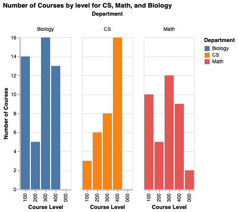
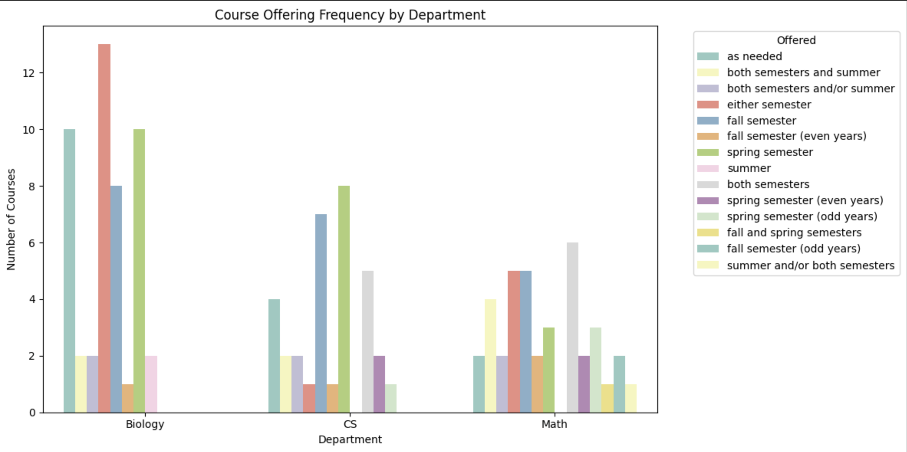

# CS200 Final Project - Hood College course catalog analysis

Scrapes and analyzes the 2024-2025 Hood College undergraduate catalog for three departments (Computer Science, Mathematics, Biology) to compare how they structure their curricula.

This was previously a standalone `DepartmentalCourseAnalysis` repository and was merged into this coursework archive alongside the other Hood CS course folders.

## Research questions

1. Which departments offer more advanced (300/400-level) courses?
2. What topics appear most often in course descriptions?
3. How are courses distributed across semesters?

## Data

Scraped live at runtime from the public Hood College catalog.
No data files are committed; the notebook re-fetches on each run.

- [CS](https://hood.smartcatalogiq.com/2024-2025/hood-college-2024-2025-catalog/undergraduate-courses/cs-computer-science/)
- [Math](https://hood.smartcatalogiq.com/2024-2025/hood-college-2024-2025-catalog/undergraduate-courses/math-mathematics/)
- [Biology](https://hood.smartcatalogiq.com/2024-2025/hood-college-2024-2025-catalog/undergraduate-courses/biol-biology/)

Each record holds department, course code and title, description, credits, and semesters offered.
This is public catalog data only.
There is no student-level information of any kind: no enrollments, no grades, no rosters, no names.

## Method

`BeautifulSoup` extracts structured fields from the catalog HTML.
`pandas` and regex clean descriptions, titles, and credit values.
Department-specific stop word lists filter out academic boilerplate before word counting.

Analysis is **descriptive only** - group counts, `value_counts`, and `collections.Counter` word frequencies, visualized with Altair, Seaborn, and WordCloud.
No hypothesis test, model, or inferential statistic is computed, so the findings below describe this one catalog year and should not be read as significant differences between departments.

## Findings

### Course level distribution

  

| Department | Most courses at level |
|---|---|
| CS | 300-level |
| Biology | 400-level |
| Math | Balanced (100-300) |

CS concentrates on mid-level technical depth, while Biology skews toward advanced lab-intensive coursework.

### Keyword emphasis

| Department | Most frequent description terms |
|---|---|
| CS | design, data, systems, algorithms |
| Math | theory, equations, problem, functions |
| Biology | ecology, genetics, molecular, human |

Each department has a distinct vocabulary that reflects its focus.

### Semester distribution

  

| Department | Offering pattern |
|---|---|
| CS | Concentrated in Spring and "either semester" |
| Math | Roughly uniform across Fall and Spring |
| Biology | Widest variety (Fall, Spring, both) |

Biology offers the most scheduling flexibility.

## How to run

1. Open `CS200_final_project.ipynb` in Jupyter or Google Colab.
2. Run all cells.

The notebook installs its own dependencies and scrapes the catalog directly, so there is no `requirements.txt` and no data setup.
Because it fetches live pages, results will drift if Hood publishes a new catalog year or changes its page structure.

## Limitations

- Course descriptions may not reflect actual content or difficulty.
- Covers a single academic year, so no trend over time can be inferred.
- Stop word filtering is heuristic; some academic boilerplate survives it.
- Counts are unnormalized, so a department with more total courses will appear larger on every chart.

## Provenance

Graded final project for CS200.
The scraping, cleaning, analysis, and write-up are mine; the catalog content belongs to Hood College.
